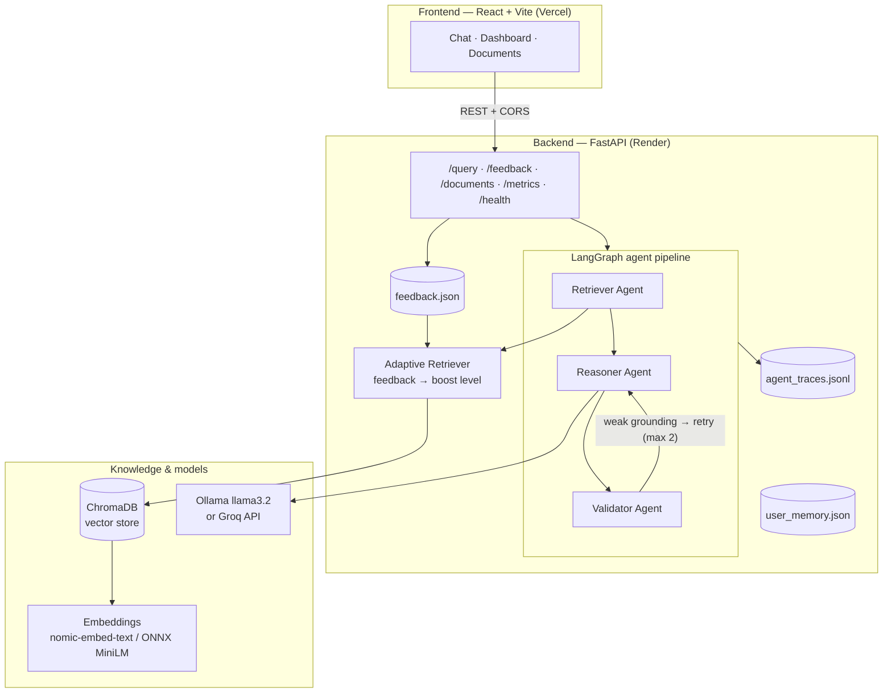

# 🧠 CortexRAG

**A full-stack cognitive multi-agent RAG system.** Upload documents, ask questions, and get answers that are *retrieved, reasoned, validated, and traced* — with confidence scores, source citations, feedback-driven adaptive retrieval, and a live observability dashboard.

- **Backend:** FastAPI + LangGraph + ChromaDB (deployed on **Render**)
- **LLM:** Ollama (`llama3.2`) locally · **Groq** (`openai/gpt-oss-20b`, free tier) in the cloud
- **Embeddings:** `nomic-embed-text` via Ollama locally · ONNX MiniLM in-process in the cloud
- **Frontend:** React + Vite + TypeScript (deployed on **Vercel**)
- **MCP:** optional server so Claude can query your documents as a tool

**Live:** app → https://cortexrag.vercel.app · API → https://cortexrag-api.onrender.com/docs

---

## Architecture



## What happens when you ask a question

1. **`POST /query`** hands your question to the compiled LangGraph.
2. **Retriever agent** — embeds the question, does semantic search in ChromaDB (top 3 chunks), and asks the **adaptive retriever** for a *boost level*: if this exact query earned high ratings before, retrieval is marked `high` confidence.
3. **Reasoner agent** — builds a prompt containing the retrieved chunks + recent conversation memory, with a strict instruction: *answer ONLY from the documents*. The LLM (Ollama locally, Groq in prod) writes the answer.
4. **Validator agent** — computes a lexical grounding score (fraction of answer words present in the retrieved chunks). Score ≥ 0.30 → valid. If not, the graph **loops back to the reasoner** (max 2 retries).
5. Every agent execution is **traced** to `agent_traces.jsonl` (latency, inputs, outputs) — this feeds all `/metrics/*` endpoints and the dashboard.
6. The response returns the answer plus **confidence, validity, boost level, retries, latency, citations, source chunks and distances**.
7. You rate the answer ★1–5 → **`POST /feedback`** → stored → future retrievals of that query get boosted. That closes the cognitive loop.

## Project structure

```
cognitive-brain/
├── backend/
│   ├── config.py             # all env-driven settings in one place
│   ├── api/
│   │   ├── main.py           # FastAPI app: query, feedback, documents, memory, health
│   │   └── metrics.py        # /metrics/* — computed from agent traces
│   ├── agents/
│   │   ├── graph.py          # LangGraph wiring + tracing + retry routing
│   │   ├── retriever.py      # semantic search + adaptive boost
│   │   ├── reasoner.py       # grounded answer generation
│   │   ├── validator.py      # grounding score + retry counter
│   │   └── state.py          # shared AgentState
│   ├── llm/client.py         # provider switch: ollama | groq | openai (+ embeddings)
│   ├── memory/
│   │   ├── vector_store.py   # ChromaDB: upsert, query, list, delete
│   │   ├── feedback_*.py     # ratings storage + per-query scores
│   │   ├── user_memory.py    # long-term key/value memory
│   │   └── conversation_memory.py
│   ├── retrieval/            # adaptive retriever + simple RAG pipeline
│   ├── observability/        # tracer (JSONL) + logger
│   ├── utils/                # chunker, citations, similarity
│   └── ingest_pdf.py         # PDF → chunks → embeddings → Chroma
├── frontend/                 # React + Vite + TS (chat, dashboard, documents)
├── mcp_server/               # optional MCP server for Claude
├── documents/                # PDFs to index (auto-ingested when store is empty)
├── requirements.txt
├── render.yaml               # Render blueprint (backend)
├── Dockerfile                # alternative container deploy
└── .env.example
```

## Run locally

**Prereqs:** Python 3.11, Node 18+, [Ollama](https://ollama.com) with models pulled:

```bash
ollama pull llama3.2
ollama pull nomic-embed-text
```

**Backend** (from the repo root):

```bash
python -m venv venv
venv\Scripts\activate          # Windows   (source venv/bin/activate on mac/linux)
pip install -r requirements.txt
python -m backend.ingest_pdf   # index the PDFs in documents/
uvicorn backend.api.main:app --reload
```

API: http://127.0.0.1:8000 · Swagger: `/docs` · legacy dashboard: `/dashboard`

**Frontend** (second terminal):

```bash
cd frontend
npm install
npm run dev
```

App: http://localhost:5173 (points at `http://127.0.0.1:8000` by default; override with `frontend/.env` → `VITE_API_URL`).

## Configuration

Copy `.env.example` → `.env`. Everything has sensible local defaults.

| Variable | Default | Purpose |
|---|---|---|
| `LLM_PROVIDER` | `ollama` | `ollama` \| `groq` \| `openai` |
| `OLLAMA_HOST` | `http://127.0.0.1:11434` | accepts `0.0.0.0`, `host:port`, full URLs |
| `OLLAMA_MODEL` | `llama3.2` | generation model |
| `GROQ_API_KEY` | — | required when `LLM_PROVIDER=groq` |
| `GROQ_MODEL` | `openai/gpt-oss-20b` | Groq model (check `/health/models` for what your key can use) |
| `EMBEDDING_PROVIDER` | `ollama` | `ollama` (nomic-embed-text) \| `local` (ONNX MiniLM, serverless) |
| `ALLOWED_ORIGINS` | `*` | CORS — set your Vercel URL in prod |
| `CORTEX_API_KEY` | *(empty = off)* | when set, mutating endpoints require `X-API-Key` |
| `AUTO_INGEST` | `true` | index `documents/` at boot if the store is empty |
| `DATA_DIR` / `CHROMA_DIR` / `DOCS_DIR` | repo folders | point at a mounted disk in prod |

> Each embedding provider uses its own Chroma collection (vector dimensions differ: 768 vs 384), so switching providers just means re-ingesting — nothing breaks.

## Deploy

### 1. Backend → Render (free)

1. Get a free Groq key: https://console.groq.com/keys (the cloud can't run Ollama — Groq serves Llama models over an API, free tier included).
2. Push this repo to GitHub.
3. Render dashboard → **New → Blueprint** → select the repo. `render.yaml` provisions everything (Python 3.11, build, start command, health check).
4. Set the `GROQ_API_KEY` env var when prompted → deploy.
5. First boot auto-ingests `documents/` (the store is empty in the cloud). Verify: `https://<your-app>.onrender.com/health` → `"llm_ok": true`.

Notes: the free plan sleeps after ~15 min idle and has an **ephemeral disk** — the index rebuilds from `documents/` on each cold start (~60s, mostly the one-time embedding-model download), but *uploads and feedback reset*. For persistence, attach a disk (see comments in `render.yaml`). Startup ingestion runs off the main thread so the port binds immediately; `/query` waits for the index rather than answering from an empty store, and `/health` reports `index_ready`.

**Before a live demo:** open the app ~2 minutes early and ask one throwaway question. That wakes the server, rebuilds the index, and warms everything — so the demo itself is instant. A cold first request can otherwise take a minute while the service spins up.

### 2. Frontend → Vercel (free)

1. Vercel → **Add New → Project** → import the same repo.
2. **Root Directory: `frontend`** (Vite is auto-detected).
3. Add env var `VITE_API_URL = https://<your-app>.onrender.com` (no trailing slash).
4. Deploy → you get `https://<project>.vercel.app`.
5. Lock down CORS: on Render set `ALLOWED_ORIGINS=https://<project>.vercel.app` and redeploy.

### Alternative: Docker

`Dockerfile` at the root runs the API anywhere containers run (Railway, Fly.io, Cloud Run): `docker build -t cortexrag . && docker run -p 8000:8000 -e GROQ_API_KEY=... cortexrag`

## MCP server (use CortexRAG from Claude)

```bash
pip install "mcp[cli]" requests
claude mcp add cortexrag -- python -m mcp_server.server
```

Tools exposed: `ask_cortexrag(question)`, `list_documents()`, `get_metrics()`. Point it at a deployed API with `CORTEX_API_URL`. Claude Desktop config example is in `mcp_server/server.py`.

## API reference

| Method | Path | Description |
|---|---|---|
| `POST` | `/query` | run the agent pipeline; returns answer + confidence + citations |
| `POST` | `/feedback` | rate an answer 1–5 (drives adaptive retrieval) |
| `GET` | `/documents` | indexed sources + chunk counts |
| `POST` | `/documents/upload` | multipart PDF/TXT → chunk → embed → index |
| `DELETE` | `/documents/{source}` | remove a document from the index |
| `GET/POST/DELETE` | `/memory` | long-term key/value memory |
| `GET` | `/metrics/agents` | per-agent run counts + latency |
| `GET` | `/metrics/history` | recent queries |
| `GET` | `/metrics/confidence` | validator score stats |
| `GET` | `/metrics/feedback` | rating stats |
| `GET` | `/metrics/sources` | retrieval counts per document |
| `GET` | `/health` | provider status + index size |

## v2.0 — what changed from v1

- `/query` now runs the **real LangGraph pipeline** (v1 wired the API to a simple non-agent pipeline; the graph only ran in tests).
- **Tracing actually happens** — agent nodes are wrapped, so metrics reflect live traffic.
- **Chunker fixed**: PDF text (single newlines) previously became *one giant chunk per file*; now it hard-splits with overlap → real semantic retrieval.
- **Ingestion IDs fixed**: `{filename}::{chunk}` upserts instead of colliding numeric IDs that silently dropped data.
- Retry loop fixed (router state mutations don't persist in LangGraph — the validator now owns the counter).
- New: feedback/upload/delete/memory/health endpoints, CORS, optional API-key auth, provider-switchable LLM + embeddings, auto-ingest on empty store, React frontend, Render/Vercel/Docker deploy configs, MCP server.
